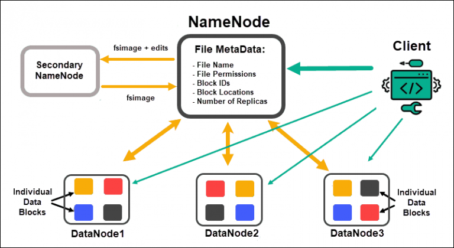
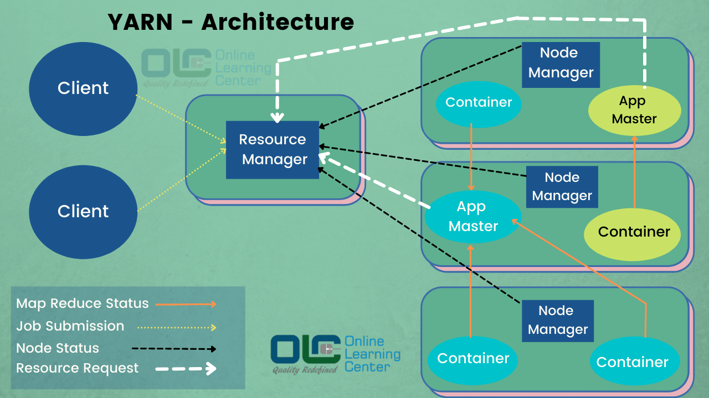
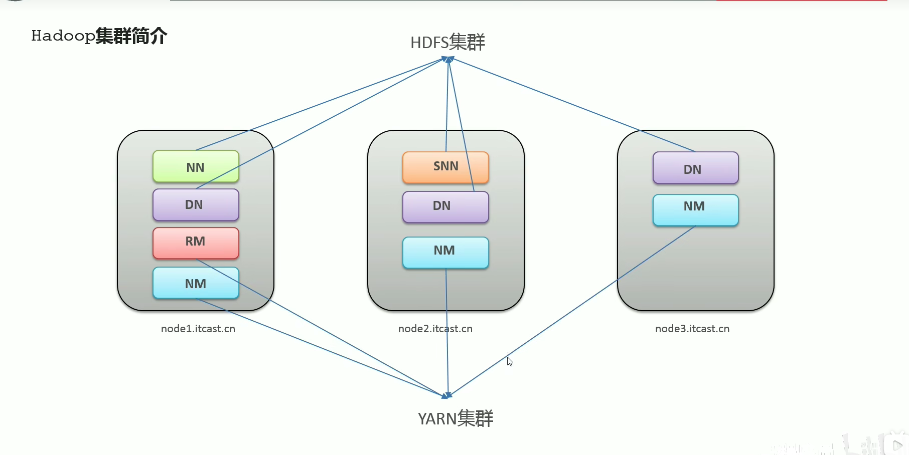
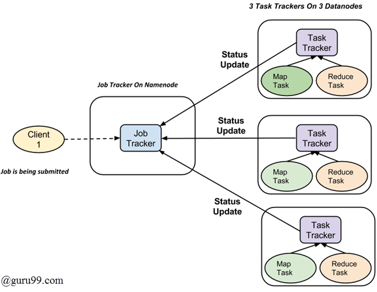
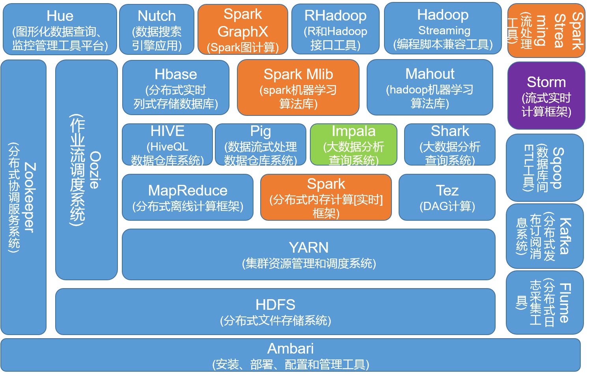

# Hadoop

Hadoop核心组件
: 1. Hadoop HDFS（分布式文件存储系统）
: 2. Hadoop YARN（集群资源管理和任务调度框架）
: 3. Hadoop MapReduce（分布式计算框架）

HDFS集群
: 主角色: NameNode
: 从角色: DataNode
: 主角色的辅助角色: SecondaryNameNode
: 

YARN集群
: 主角色: ResourceManager
: 从角色: NodeManager
: 

一个三节点Hadoop集群示例
: 

MapReduce计算示意图
: 

Hadoop生态圈
: 